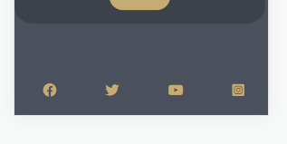
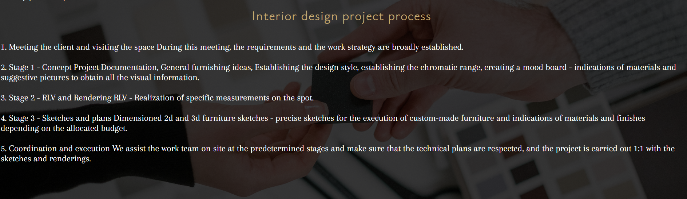

# AboveStudio
Interior designers for your home!

(Developer: Grozav Sarah-Ligia)

[Live webpage](https://sarahgrozav1.github.io/AboveStudio/
)

## My Mood Board

# Introduction

Above Studio its a page with two designers from Dubai. They offer professional interior design. The site targets people who want their home to look cozy, luxury and most important profesionally designed and organized.

# Project Goals

### User Goals
- Find profesional interior designers 
- Find different iterior designs styles
- Find friendly designers and  easy-to-use site
- Find a friendly community

### Site Owner Goals
- Attract people who want to design their place professionaly
- Increase numbers people from our communitys
- Promote us as ideal interior designers for people to chose

# User Experience

## Strategy

#### Target Audience
- People who don't know anything about interior design 
- People who want to have a house professional designed
- People who want to have their houses with less clutter and well organized

#### User Requirements and Expectations
- Simple and intuitive navigation system.
- Find relevant information easily and quickly.
- Links work as expected.
- Easy way to contact the business.
- Visually appealing responsive design.
- Accessibility.

## User Stories

### First-time User

As a first time user, I want to ...
1. ... know what services are offered at Above Studio.
2. ... know how to get in contact with the business and request more information.

### Site owner
As the site owner, I want users to ...
1. ... feel comfortable and at ease reaching out for more information.

## Scope

### Intial Stage

At the initial stage the site will include the basic relevant information. It will include information about the designers. It will communicate to the user the experience and trustworthyness of the staff running the space. It will make contacting the designers easy by completing the formula. The site will include a picture gallery off interior designed places with different styles that customers requested.

### Future Additions

In future expansion the site could include a section or a page with prices so that the clients know better what to expect. 

# Structure

## Wireframes

The structure of the initial site will include three sections and two pages:

1. **Home Section** with navigation features in a header and footer, a section where is a small description of what the site is about.

 

2. **About Section** here we have some thoughts from our designers and a smaller image so that people could see them.

 

3. **Contact Section** here we have a form for our interested clients and on the left side the address mobile phone and email of our designers. On the bottom of the contact section we have footer where its our copyright message and network icons so that they can see what other clients are saying about the designers.

 

4. **About Us page** with more information, more details about the interior design project process. This page will include the same header and footer as the main page.

 

5. **Gallery Page** Here we have some pictures with interior design made by Above Studio. This page will include the same header and footer as the main page.

 

6. **404 Page** - a simple 404 Error page is also included.

## Skeleton

As described in the previous section with the aid of wireframes, the website includes three sections and two pages, which all pages have a consistent header and footer. The home page includes several calls to action, which is link to the about page and the gallery page. Here are more details of the various page features:

### Header

Screenshot of header on desktop

Screenshot of header on mobile

- Featured on all main pages (and the 404 page).
- Includes the company name/logo and a menu with links to the Homepage, About page, Gallery page and Contact Section.
- The header is fully responsive and changes to fill two lines on smaller screens.
- If a user hovers over a menu option an animated bar and color change shows them which option they are choosing. 

### Footer

Screenshot of Footer

Screenshot of footer on mobile

- Featured on all main pages (and the 404 page).
- Includes links to the social media pages which the company maintains: Facebook, Twitter, Instragram, and YouTube.
- All links open in a new window.

### The Project Process

Screenshot of Project Process

- Information for clients on how the process needs to be done.

### Call to action

Screenshot of HIRE US action

Screenshot of READ MORE action

- HIRE US button features immediately below the cover text. It links to the Contact Section where is the form.
- READ MORE button features immediately bellow the paragraph from About Us Section and it links to the About Page.

### About page

Screenshot of About page top

Screenshot of About page bottom

- Features more interesting information for the clients and an interior design project process.

### Contact section

Screenshot of Conact section

- Features a form that a client can submit to express specific interest and request more information.

### Gallery page 

Screenshot of Gallery page top

Screenshot of Gallery page bottom

- Features images of designers work. 

### Future Additions

- A feature to be implemented in the future is a map with the location of the Above Studio at the bottom of the Contact section.

