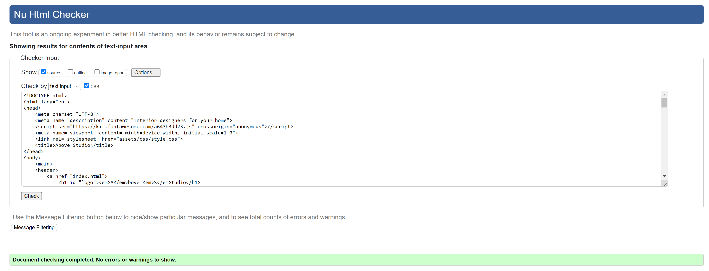
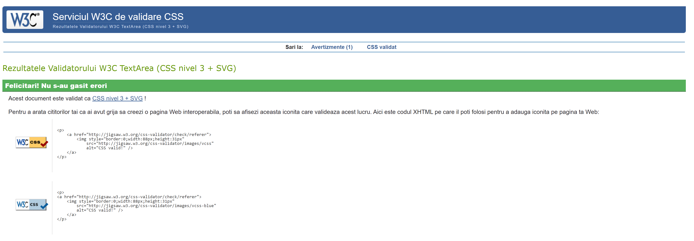

# AboveStudio
Interior designers for your home!

(Developer: Grozav Sarah-Ligia)


[Live webpage](https://sarahgrozav1.github.io/AboveStudio/
)

## My Mood Board


# Introduction

Above Studio its a page with two designers from Dubai. They offer professional interior design. The site targets people who want their home to look cozy, luxury and most important profesionally designed and organized.

# Project Goals

### User Goals
- Find profesional interior designers 
- Find different iterior designs styles
- Find friendly designers and  easy-to-use site
- Find a friendly community

### Site Owner Goals
- Attract people who want to design their place professionaly
- Increase numbers people from our communitys
- Promote us as ideal interior designers for people to chose

# User Experience

## Strategy

#### Target Audience
- People who don't know anything about interior design 
- People who want to have a house professional designed
- People who want to have their houses with less clutter and well organized

#### User Requirements and Expectations
- Simple and intuitive navigation system.
- Find relevant information easily and quickly.
- Links work as expected.
- Easy way to contact the business.
- Visually appealing responsive design.
- Accessibility.

## User Stories

### First-time User

As a first time user, I want to ...
1. ... know what services are offered at Above Studio.
2. ... know how to get in contact with the business and request more information.

### Site owner
As the site owner, I want users to ...
1. ... feel comfortable and at ease reaching out for more information.

## Scope

### Intial Stage

At the initial stage the site will include the basic relevant information. It will include information about the designers. It will communicate to the user the experience and trustworthyness of the staff running the space. It will make contacting the designers easy by completing the formula. The site will include a picture gallery off interior designed places with different styles that customers requested.

### Future Additions

In future expansion the site could include a section or a page with prices so that the clients know better what to expect. 

# Structure

## Wireframes

The structure of the initial site will include three sections and two pages:

1. **Home Section** with navigation features in a header and footer, a section where is a small description of what the site is about.

 

2. **About Section** here we have some thoughts from our designers and a smaller image so that people could see them.

 

3. **Contact Section** here we have a form for our interested clients and on the left side the address mobile phone and email of our designers. On the bottom of the contact section we have footer where its our copyright message and network icons so that they can see what other clients are saying about the designers.

 

4. **About Us page** with more information, more details about the interior design project process. This page will include the same header and footer as the main page.

 

5. **Gallery Page** Here we have some pictures with interior design made by Above Studio. This page will include the same header and footer as the main page.

 

6. **404 Page** - a simple 404 Error page is also included.

## Skeleton

As described in the previous section with the aid of wireframes, the website includes three sections and two pages, which all pages have a consistent header and footer. The home page includes several calls to action, which is link to the about page and the gallery page. Here are more details of the various page features:

### Header
<details>
<summary>Screenshot of header on desktop</summary>

</details>
<details>
<summary>Screenshot of header on mobile</summary>

</details>

- Featured on all main pages (and the 404 page).
- Includes the company name/logo and a menu with links to the Homepage, About page, Gallery page and Contact Section.
- The header is fully responsive and changes to fill two lines on smaller screens.
- If a user hovers over a menu option an animated bar and color change shows them which option they are choosing. 

### Footer
<details>
<summary>Screenshot of Footer</summary>

</details>
<details>
<summary>Screenshot of footer on mobile</summary>

</details>

- Featured on all main pages (and the 404 page).
- Includes links to the social media pages which the company maintains: Facebook, Twitter, Instragram, and YouTube.
- All links open in a new window.

### The Project Process
<details>
<summary>Screenshot of Project Process</summary>

</details>

- Information for clients on how the process needs to be done.

### Call to action
<details>
<summary>Screenshot of HIRE US action</summary>

</details>

- HIRE US button features immediately below the cover text.
- If I press the HIRE US button it will take me to Contact section where its the form.

<details>
<summary>Screenshot of READ MORE action</summary>

</details>

- READ MORE button features immediately bellow the paragraph from About Us Section.
- If I press READ MORE button it will take me to About page where it gives you more information about the designers.

<details>
<summary>Screenshot of SEND action</summary>

</details>

- SEND button its in the form witch is in the Contact section.
- If I press SEND button it wont happen nothing until I will fill every required field. And after I fill every field then it will refresh the page and get back down to Contact section.


### About page
<details>
<summary>Screenshot of About page top</summary>

</details>
<details>
<summary>Screenshot of About page bottom</summary>

</details>

- Features more interesting information for the clients and an interior design project process.

### Contact section
<details>
<summary>Screenshot of Conact section</summary>

</details>

- Features a form that a client can submit to express specific interest and request more information.

### Gallery page 
<details>
<summary>Screenshot of Gallery page top</summary>

</details>
<details>
<summary>Screenshot of Gallery page bottom</summary>

</details>

- Features images of designers work. 

### 404 error page
<details>
<summary>Screenshot of Gallery page top</summary>

</details>

- A 404 page will be implemented and will display if a user navigates to a broken link.
- The 404 page will allow the user to easily navigate back to the main website if they direct to a broken link / missing page, without the need  of the browsers back button.

### Future Additions

- A feature to be implemented in the future is a map with the location of the Above Studio at the bottom of the Contact section.

# Page Design

## Surface

The surface design of the website is a simple design , maintaining easy of readability. The color schemes and font were chosen accordingly.

### Color Scheme

The color scheme I choosed is inspired from pinterest, from mycolor.space which I know from Code Institute and from pictures that I chose to be for this site. I like the contrast from dark blue to white and yellow it gives me some luxury feeling.


### Font

Arapey is the font used for high level heading such as the logo and menu links and lowerlevel headings use Ysabeau font. These fonts were chosen for the artistic character and to convey the fluency and flexibility of artistic experimentation.

## Technologies Used

### Languages
- HTML
- CSS

### Frameworks & Tools
- GitHub
- VS Code
- Google Fonts
- Font Awesome
- ColorSpace
- Pexels
- W3 Schools
- Youtube

## Testing and Validation

### HTML Validation

The W3C Markup Validation Service was used to validate the HTML of the website. All pages passed with no errors or warnings.

<details>
<summary>Home page</summary>

</details>

<details>
<summary>About Page</summary>

</details>

<details>
<summary>Gallery Page</summary>

</details>

### CSS Validation

The W3C Jigsaw CSS Validation Service was used to validate the CSS of the website. The code passed with no errors or warnings.

<details>
<summary>CSS Validation Screenshot</summary>

</details>

### Accessibility & Performance

The Lighthouse feature on Google Devtools was used to assess accessibility and performance. All pages score high on accessibility. The gallery page scores lowest on performance due to the large number of images.

<details>
<summary>Home Page</summary>

</details>

<details>
<summary>About Page</summary>

</details>

<details>
<summary>Gallery Page</summary>

</details>

## Outstanding Issues

When I tested Gallery page in HTML validation I haved an error because I used space between images name, I fixed with a short line between those two words.

## Browser Compatability

The websites compatability was tested on the following browsers:

* Google Chrome
* Microsoft Edge
* Safari

## Room for improvement on User Stories

While all the minimum criteria for fullfilling the user stories are met, there are several items that could be improved upon:

1. A map could be included at the bottom of the home page to give more explicit directions to the location.

2. A section or a page where are prices so that posible clients to know  what to expect. 

## Bugs & Fixes

| **Bug** | **Fix** |
| ----------- | ----------- |
| Menu links failed on small screen sizes | Font size of logo and menu was decreased and menu floated left to fit header on two lines. |
| Images from Gallery Page was loading very hard | By compressing them I sized down their KB , making  them loading a little bit faster. | 


## Deployment & Development

### Version Control

The site was created using the GitHub editor.

The following git commands were used throughout development to push code to the remote repo:

```git add <file>``` - This command was used to add the file(s) to the staging area before they are committed.

```git commit -m “commit message”``` - This command was used to commit changes to the local repository queue ready for the final step.

```git push``` - This command was used to push all committed code to the remote repository on github.

### Deployment

The website was deployed using GitHub Pages by following these steps:

1. In the GitHub respository navigate to the Settings tab.
2. Select Pages from the menu on the left-hand side of the page.
3. For the source select Branch: 'main' and then select: 'save'.
4. After the webpage refreshes automatically a ribbon at the top will displays the following message: "Your site is live at https://sarahgrozav1.github.io/AboveStudio/"

The website repository can be forked by the following steps:

1. Go to the GitHub repository.
2. Click on the Fork button in the upper right hand corner.

The repository can be cloned by the following steps:

1. Got to the GitHub repository.
2. Locade the Code button above the list of files and click on it.
3. Select if you prefer to clone using HTTPS, SSH, or Github CLI and click the copy button to copy the URL to your clipboard.
4. Open Git Bash.
5. Change the current working directory to the one where you want the cloned directory.
6. Type git clone and paste the URL from the clipboard ($ git clone https://github.com/YOUR-USERNAME/YOUR-REPOSITORY)
7. Press Enter to create your local clone.

## Credits

### Media

Images:
*All images are from pixels.com

### Code
- The website was loosely modeled on and inspired by the Love Running Walkthough project and some of the code from the walkthrough project was used and adapted.
- <a href="https://www.w3schools.com/">W3 Schools</a> was a great help in my whole project.
- This README file was guided by the README file from <a href="https://github.com/URiem/art-school/blob/main/README.md">URiem - Creative Spaces</a>.
- The <a href="https://cbea.ms/git-commit/">How to Write a Git Commit Message was very helpful recource for learning to write in Terminal.
- The <a href="https://www.joshwcomeau.com/css/interactive-guide-to-flexbox/">An Interactive Guide to Flexbox site was also very helpful on how to use Flexbox.

### Acknowledgements

I would like to thank:
- My husband, Filip, for his encouragement and support along the way.
- My mentor Daisy Mc Girr for her feedback, advice, guidance and support.
- To Chris W Alumnus from Slack, for his help when I needed.
